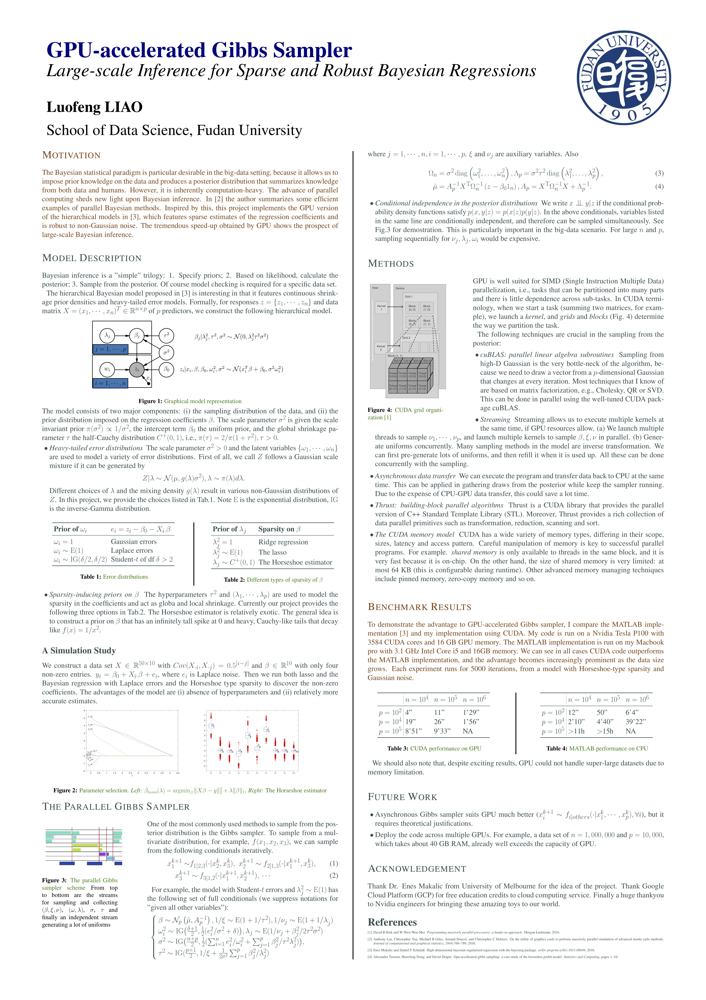

# GPU-accelerated Gibbs Sampler
The [poster](https://github.com/Banana1530/GPU-accelerated-Gibbs-Sampler/blob/master/LLF-poster-final.jpg) here gives a thorough description of the entire project, including a description of the model, a simulation study comparing the model with lasso, and benchmark results in comparison with its MATLAB implementation. It gains at most 100x speed-up on super large dataset.

__The poster is awarded the Runnerup Award out of around 30 equally competitive posters in the student poster section of [2018 Fudan Science and Innovation Forum](https://fbdc.fudan.edu.cn/2018/27/66/c20519a206694/page.htm).__



## What it does

This project implements the GPU version of the MATLAB `Bayereg` package [1], which features Bayesian linear regression with  Gaussian or heavy-tailed error models with ridge, and lasso, horseshoe and horseshoe+ estimators

## Environment

The package is developed under Ubuntu 16.0.

First, please make sure you have CUDA package installed. Check this by typing the following command.

```shell
nvcc --version
nvidia-smi
```

In my case, I have the following output.

```shell
$ nvcc --version
nvcc: NVIDIA (R) Cuda compiler driver
Copyright (c) 2005-2016 NVIDIA Corporation
Built on Tue_Jan_10_13:22:03_CST_2017
Cuda compilation tools, release 8.0, V8.0.61

$ nvidia-smi
Sat Dec 15 08:56:32 2018
+-----------------------------------------------------------------------------+
| NVIDIA-SMI 410.79       Driver Version: 410.79       CUDA Version: 10.0     |
|-------------------------------+----------------------+----------------------+
| GPU  Name        Persistence-M| Bus-Id        Disp.A | Volatile Uncorr. ECC |
| Fan  Temp  Perf  Pwr:Usage/Cap|         Memory-Usage | GPU-Util  Compute M. |
|===============================+======================+======================|
|   0  Tesla P100-PCIE...  Off  | 00000000:00:04.0 Off |                    0 |
| N/A   40C    P0    30W / 250W |    100MiB / 16280MiB |      0%      Default |
+-------------------------------+----------------------+----------------------+

+-----------------------------------------------------------------------------+
| Processes:                                                       GPU Memory |
|  GPU       PID   Type   Process name                             Usage      |
|=============================================================================|
|    0      1703      G   /usr/lib/xorg/Xorg                           100MiB |
+-----------------------------------------------------------------------------+
```

Second, the tests in the program use R, so also make sure you install the following R pacakges. Make sure R can be called in any directory. (It's a little bit clumsy though.)

```R
library("readr")
library("e1071")
```

## Run tests

First, complie the package by typing `make` in the command line. To clean up the output files and the executable, type `make clean`.

By default, if you run `./a.out`, the program will run a series of tests, using test files under the folder `./test_data`. An example output should look like:

```
====  TEST 1: Initialization ====
[INFO]: Initialize a GpuGibbs object, data size: n = 4, p = 3.
[INFO]: Successful initialization
====  PASS TEST 1 ====

====  TEST 2: Residual update ====
[INFO]: Initialize a GpuGibbs object, data size: n = 4, p = 3.
[INFO]: Successful initialization
==== PASS TEST 2 ====

====  TEST 3: Gamma (single update, sigmaSqInv) dist ====
[INFO]: Initialize a GpuGibbs object, data size: n = 4, p = 3.
[INFO]: Successful initialization
Empirical estimate: alpha = 3.500000, beta = 2.000000
[1] "mean =  1.744453694125"
[1] "var  =  0.874717715798537"
[1] "skew =  1.03556626743185"
Expected estimate:
[1] mean  =  1.75
[1] var   =  0.875
[1] skew  =  1.069045

Empirical estimate: alpha = 3.500000, beta = 3.500000
[1] "mean =  1.00993304771613"
[1] "var  =  0.289166113645945"
[1] "skew =  1.00366855371814"
...
```

## Timming

```shell
./a.out 10000 1000 5000 0
```

The above command will generate a dataset of 10000 x 1000, and run the Gibbs sampler for 5000 iterations. The `0` means we skip the testing. An example output should look like

```shell
$ ./a.out 10000 1000 5000 0

n=10000, p=1000, iter=5000
[INFO]: Initialize a GpuGibbs object, data size: n = 10000, p = 1000.
[INFO]: Start generating data
[INFO]: Finish generating data
[INFO]: Successful initialization
Iter = 0, time = 0.022564, expeted total = inf
Iter = 100, time = 0.426637, expeted total = 21.331847
Iter = 200, time = 0.810320, expeted total = 20.257998
Iter = 300, time = 1.190723, expeted total = 19.845382
Iter = 400, time = 1.572329, expeted total = 19.654110
Iter = 500, time = 1.950976, expeted total = 19.509759
Iter = 600, time = 2.325463, expeted total = 19.378857
...
```

## Reference

[1] Makalic, Enes, and Daniel F. Schmidt. "High-Dimensional Bayesian Regularised Regression with the BayesReg Package." arXiv preprint arXiv:1611.06649 (2016).

[2] Terenin, Alexander, Shawfeng Dong, and David Draper. "GPU-accelerated Gibbs sampling: a case study of the Horseshoe Probit model." Statistics and Computing 29.2 (2019): 301-310.
